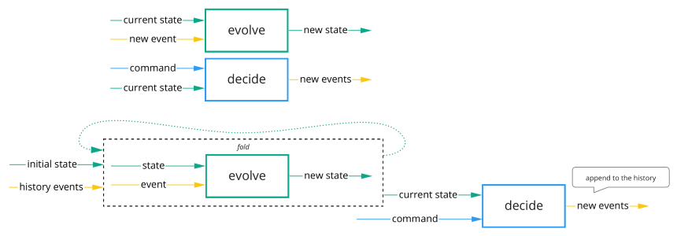
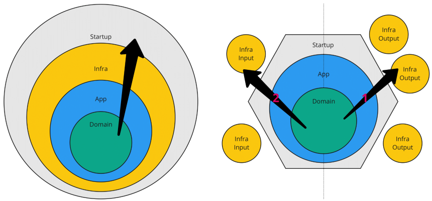

# Bank account kata and functional Event Sourcing

__Work in progress__

## Decider

Deciders should have at least an initial state and two functions:

- `evolve: 'State -> 'Event -> 'State`\
  Given the current state and what happened, evolve to a new state.

  - From new events: `fold evolve currentState newEvents`
  - From the history: `fold evolve initialState history`

- `decide: 'Command -> 'State -> 'Outcome`\
  Given what has been requested and the current state, decide what should happen.

They are composable:



It's also very convenient to create [Given-When-Then](EsBankAccount.Tests/Domain/BankAccountTests.fs) tests:

```fsharp
[<Fact>]
let ``make a deposit and calculate the balance`` () =
    spec {
        Given // history
            [ Deposited { Amount = 100m; Date = DateTime.MinValue } ]
        When  // command
            ( Deposit (50m, DateTime.MinValue) )
        Then  // what should happen
            [ Deposited { Amount = 50m; Date = DateTime.MinValue } ]
        ThenState
            { State.initial with Balance = 150m }
    }
```

### Decider Structure

It's possible to organize the Decider into five sections.\
So it will be easier to split it into separate files if it starts to grow.

|   | Section               | Filename
|---|-----------------------|----------
| 1 | types                 | BankAccount.types.fs
| 2 | state logic           | BankAccount.state.fs
| 3 | decision logic        | BankAccount.decisions.fs (could be one file per decision)
| 4 | validation (optional) | BankAccount.validations.fs
| 5 | decision pipeline     | BankAccount.pipeline.fs

### Decision Outcome

Usually there is at least two kind of Deciders:
1. System `-> 'Event list`\
   Silent, if nothing has happened then it will return an empty list. No need for validation.
1. Frontal `-> Result<'Event list, 'Error>`\
   When validation is required. For instance called from an API.\
   Could also be `-> Validation<'Event list, 'Error list>`.

## Onion Architecture

- Internal layers doesn't know about outside layers.
- Domain is pure.
- App only has a reference to the domain.
- Infra only has references to other infrastructures.
- Startup has references to the App and the Infra. Infra are injected to the App.
- We usually start to code from the inside to the right (output), then again from the inside to the left (input).



## Resources

- [Functional Event Sourcing](https://thinkbeforecoding.com/category/Event-Sourcing) by Jérémie Chassaing
- [Effective F#, tips and tricks](https://gist.github.com/swlaschin/31d5a0a2c4478e82e3ed60d653c0206b) by Scott Wlaschin
- [Equinox](https://github.com/jet/equinox) by Ruben Bartelink
